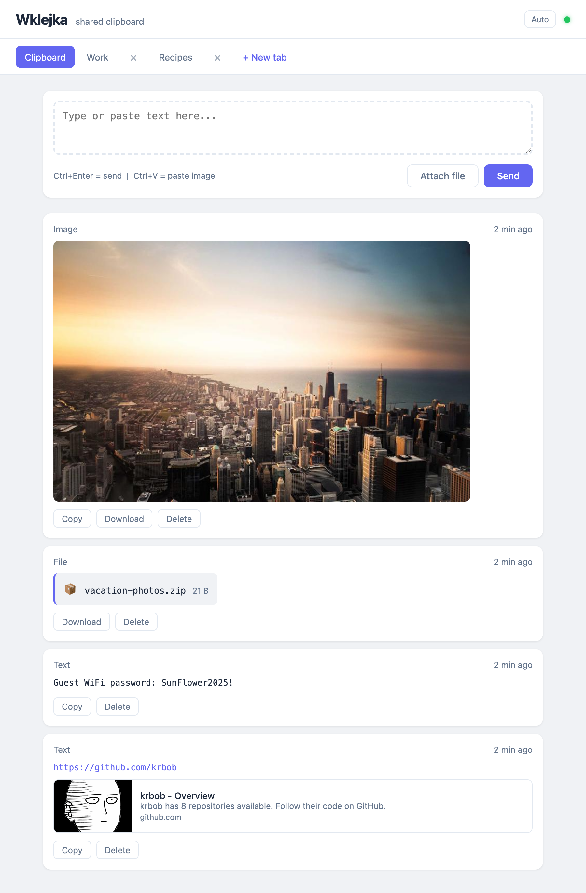

# MyClipboard

A remix of [Wklejka](https://github.com/krbob/wklejka) by [krbob](https://github.com/krbob) — a lightweight, browser-based shared clipboard with added authentication and admin management.

> **Original project**: [krbob/wklejka](https://github.com/krbob/wklejka) — lightweight, browser-based shared clipboard with real-time WebSocket sync. This fork extends it with login, user management, and admin controls.



## Features

### From Wklejka (original)

- **Text, images & files** – paste (Ctrl+V), drag and drop, or use the file picker. Inline preview for PDFs, videos, and audio.
- **Real-time sync** – WebSocket instantly propagates changes to every open browser.
- **Tabs** – separate virtual documents (e.g. "Work", "Home") with optional auto-expiry (1 h, 24 h, 7 d, 30 d). Drag to reorder, double-click to rename.
- **Tab locking** – lock a tab to prevent accidental deletion. Unlocking requires typing the tab name.
- **Copy / Download / Delete** – on every entry. Delete requires inline confirmation.
- **Link previews** – URLs in text clips automatically show a preview card.
- **Dark mode** – auto-detects system preference, manual toggle in header.
- **Persistent storage** – data survives container restarts.
- **Orphan file cleanup** – unreferenced files are removed on startup.

### Added in this fork

- **Authentication** – login screen with session-based cookie auth (7-day expiry). No access without credentials.
- **User management (Admin panel)** – admins can add, edit, and delete users with role assignment (user or admin).
- **Database reset** – admin can wipe all boards, clips, and uploaded files with a single click.
- **Database backup** – admin can export the entire database as a JSON file.
- **Clear default clipboard** – admin can clear all entries from the default Clipboard tab without deleting other boards.
- **Password-protected tabs** – when creating a tab with "Never" expiry, admins can optionally set a password.
- **1 GB file upload limit** – increased from the original 100 MB.
- **English-only UI** – removed Polish localization for a single-language experience.

## Getting started

### With Docker

1. Create a `docker-compose.yml` file:

```yaml
services:
  myclipboard:
    build: .
    ports:
      - "3000:3000"
    volumes:
      - ./data:/app/data
    restart: unless-stopped
```

2. Start the service:

```bash
docker compose up -d
```

3. Open `http://localhost:3000` in a browser.

### Without Docker

```bash
npm install
npm start
```

Then open `http://localhost:3000`.

## Authentication

On first startup, a default admin account is created. Credentials are printed to the console:

```
=== DEFAULT ADMIN ACCOUNT CREATED ===
Username: admin
Password: <random-password>
====================================
```

Use these to log in. After logging in as admin, click the gear icon in the header to open the admin panel.

## Production deployment on Ubuntu

### 1. Install Docker
```bash
curl -fsSL https://get.docker.com | sh
sudo systemctl enable --now docker
```

### 2. Pull the image
```bash
docker pull hoantrieu/clipboard-share:latest
```

### 3. Create a data directory
```bash
mkdir -p ~/myclipboard/data
```

### 4. Run the container
```bash
docker run -d \
  --name myclipboard \
  --restart unless-stopped \
  -p 3000:3000 \
  -v ~/myclipboard/data:/app/data \
  hoantrieu/clipboard-share:latest
```

### 5. Get the admin password
```bash
docker logs myclipboard 2>&1 | grep -A5 "DEFAULT ADMIN ACCOUNT"
```

### 6. Access the app
Open `http://<your-server-ip>:3000` and login with user `admin` and the password from step 5.

### Useful commands
```bash
docker logs myclipboard          # View logs
docker restart myclipboard       # Restart container
docker stop myclipboard          # Stop container
docker pull hoantrieu/clipboard-share:latest && docker restart myclipboard  # Update
```

## Admin panel

Accessible only to users with the `admin` role.

- **Users tab** — add new users, edit existing ones (username, password, role), or delete them.
- **Settings tab** — reset the entire database (boards, clips, and all uploaded files). Requires confirmation.

## Environment variables

| Variable | Default | Description |
|---|---|---|
| `PORT` | `3000` | Port to listen on |
| `DATA_DIR` | `./data` | Directory for persistent storage |
| `MAX_CLIP_BINARY_BYTES` | `1073741824` (1 GB) | Maximum file upload size in bytes |

## Tech stack

- **Backend**: Node.js, Express, WebSocket (`ws`)
- **Frontend**: Vanilla HTML, CSS, JavaScript
- **Storage**: JSON file (`data/store.json`) + filesystem for images and files
- **Auth**: Cookie-based sessions with PBKDF2 password hashing

## License

This project is a remix of [Wklejka](https://github.com/krbob/wklejka) by [krbob](https://github.com/krbob). See the original repository for license details.
